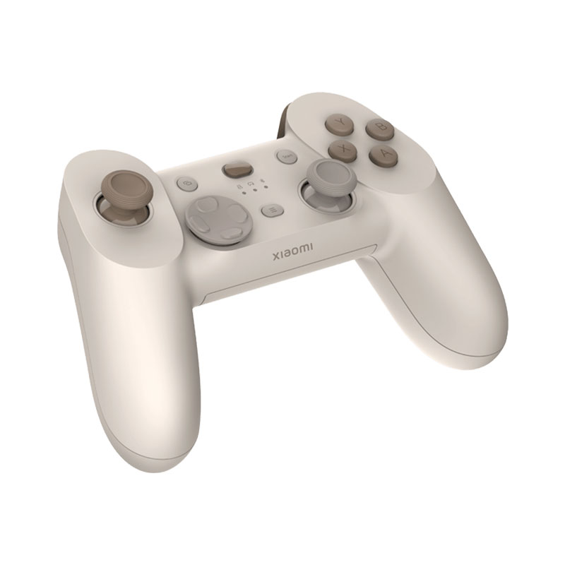

# Xiaomi Controller to Xbox 360 Emulator

A Windows application that emulates an Xbox 360 controller using a Xiaomi gamepad, providing full compatibility with games that support Xbox controllers.



## Features

- **Xbox 360 Controller Emulation**: Translates Xiaomi gamepad inputs to Xbox 360 controller signals
- **Auto-Reconnection**: Automatically detects and reconnects to the Xiaomi gamepad if disconnected
- **Full Button Mapping**: All buttons including D-pad, analog sticks, and triggers are fully mapped
- **Analog Trigger Emulation**: RT and LT are properly emulated as analog triggers with full pressure sensitivity (0-255 range)
- **Low Latency**: Direct HID communication for minimal input lag
- **Configurable Deadzones**: Built-in 10% deadzone for analog sticks to prevent drift
- **Rumble Support**: *Not yet working* - Code structure is in place but needs fixing (contributions welcome!)

## Supported Hardware

This emulator is specifically designed for the **Xiaomi Mi Game Controller** with the following specifications:
- **Vendor ID**: 0x2717
- **Product ID**: 0x5067

**Current Status**: The controller must be connected via **USB cable** to your Windows PC. Bluetooth support is planned for future releases.

## Tested Games

The emulator has been successfully tested with:
- **Need for Speed** (via Steam) - Full controller support confirmed

## Prerequisites

### System Requirements
- Windows 10/11 (64-bit)
- USB port for wired connection to Xiaomi gamepad
- Administrator privileges (for ViGEmBus driver installation)

### Required Dependencies

1. **ViGEmBus Driver**
   - Download and install from: [ViGEmBus Releases](https://github.com/nefarius/ViGEmBus/releases)
   - This driver enables virtual gamepad emulation on Windows

2. **Visual Studio Build Tools** (for building from source)
   - Install Visual Studio 2022 or newer with C++ development tools
   - Or install Build Tools for Visual Studio separately

3. **CMake** (version 3.10 or higher)
   - Download from: [CMake Downloads](https://cmake.org/download/)

4. **vcpkg** (for dependency management)
   - Installation instructions: [vcpkg Getting Started](https://vcpkg.io/en/getting-started.html)

## Building from Source

### Step 1: Install Dependencies via vcpkg

```bash
# Install vcpkg (if not already installed)
git clone https://github.com/Microsoft/vcpkg.git
cd vcpkg
.\bootstrap-vcpkg.bat
.\vcpkg integrate install

# Install ViGEmClient library
.\vcpkg install vigemclient:x64-windows
```

### Step 2: Clone the Repository

```bash
git clone https://github.com/yourusername/xiaomi_controller.git
cd xiaomi_controller
```

### Step 3: Build with CMake

```bash
# Create build directory
mkdir build
cd build

# Configure CMake (adjust vcpkg path if needed)
cmake .. -DCMAKE_TOOLCHAIN_FILE=[path to vcpkg]/scripts/buildsystems/vcpkg.cmake

# Build the project
cmake --build . --config Release
```

The executable will be generated in `build/Release/XiaomiControllerEmulator.exe`

## Usage

1. **Connect your Xiaomi gamepad** to Windows via USB cable
   - Simply plug in the USB cable to your controller and PC
   - Windows should automatically recognize the HID device

2. **Run the emulator** (as Administrator recommended):
   ```bash
   XiaomiControllerEmulator.exe
   ```

3. The program will:
   - Search for the Xiaomi gamepad
   - Create a virtual Xbox 360 controller
   - Begin translating inputs automatically

4. **Test your controller** in any game or using Windows Game Controller settings

5. **To stop**, press `Ctrl+C` in the console window

## Button Mapping

| Xiaomi Controller | Xbox 360 Controller |
|------------------|-------------------|
| A Button | A Button |
| B Button | B Button |
| X Button | X Button |
| Y Button | Y Button |
| Left Bumper | Left Bumper (LB) |
| Right Bumper | Right Bumper (RB) |
| Back Button | Back |
| Start Button | Start |
| Left Stick Click | Left Stick (LS) |
| Right Stick Click | Right Stick (RS) |
| D-Pad | D-Pad |
| Left Stick | Left Stick |
| Right Stick | Right Stick |
| Left Trigger | Left Trigger (LT) |
| Right Trigger | Right Trigger (RT) |

## Troubleshooting

### Controller Not Detected
- Ensure the Xiaomi gamepad is connected via USB cable
- Check if the controller appears in Windows Device Manager under "Human Interface Devices"
- Try unplugging and reconnecting the USB cable
- Try a different USB port
- Make sure no other programs are using the controller exclusively

### ViGEmBus Connection Failed
- Install or reinstall the ViGEmBus driver
- Run the emulator as Administrator
- Check if the ViGEmBus service is running in Windows Services


### Building Issues
- Verify all dependencies are correctly installed
- Ensure vcpkg paths are correctly set
- Check that you're using a compatible Visual Studio version
- Try cleaning and rebuilding the project

## Technical Details

### Architecture
The emulator uses:
- **Windows HID API** for reading raw input from the Xiaomi controller
- **ViGEmClient** library for creating and controlling virtual Xbox 360 controllers
- **Auto-reconnection logic** with exponential backoff for robust connection handling

### Input Processing Pipeline
1. Raw HID reports are read from the Xiaomi gamepad
2. Button states and analog values are extracted using HIDP functions
3. Values are scaled and mapped to Xbox 360 controller ranges
4. Deadzones are applied to analog sticks
5. Translated input is sent to the virtual Xbox controller

### Performance
- Polling rate: As fast as the controller provides input (typically 250Hz via USB)
- Latency: < 5ms additional latency over direct controller input
- CPU usage: Minimal (< 1% on modern systems)

## Contributing

Contributions are welcome through pull requests! Areas where help is especially appreciated:
- **Rumble/Force Feedback** - Fixing the rumble implementation (code structure exists but needs work)
- **Bluetooth support** - Adding wireless connectivity
- Bug fixes
- Support for additional Xiaomi controller models
- Performance improvements
- Additional features
- Cross-platform support (Linux/macOS)

Please feel free to submit pull requests or open issues on the project repository.

## License

This project is licensed under the MIT License - see the [LICENSE](LICENSE) file for details.

## Acknowledgments

- [ViGEm](https://vigembusdriver.com/) - Virtual Gamepad Emulation Framework
- [Microsoft Windows SDK](https://developer.microsoft.com/en-us/windows/downloads/windows-sdk/) - HID and SetupAPI libraries
- Xiaomi for creating an affordable gaming controller

## Disclaimer

This project is not affiliated with or endorsed by Xiaomi or Microsoft. Xbox 360 is a trademark of Microsoft Corporation.